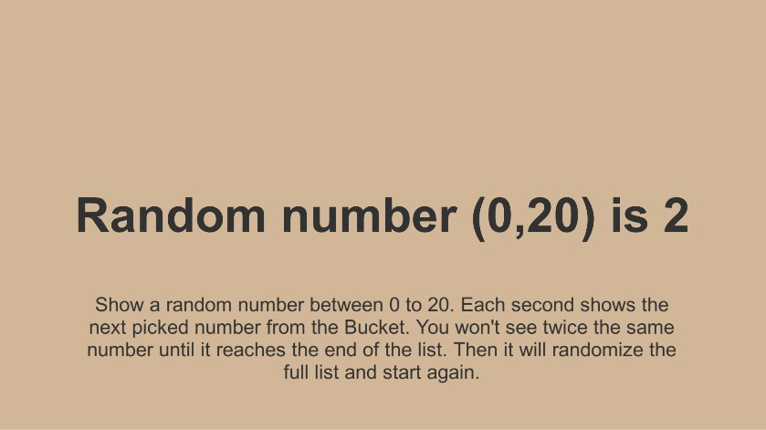

# Bucket Generator

A bucket (or bean bag) is a tool to get random numbers within an interval only once.

This bucket generator provides an easy way for random round robin algorithm.

## Usage

Instantiate a new BucketGenerator and call GetRandomNumber to obtain a number from the bucket.

### Demo
A demo scene is present under the Sample folder.

