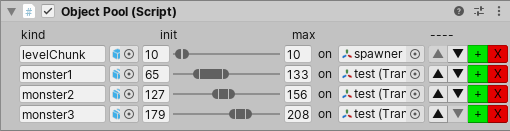

# Object Pool & Inspector

Use ObjectPool to instantiate game objects during loading time and not during gameplay.
This version allows you to havec multiple pools in your game.

## Usage

1. Put the ObjectPool script in a game object that won't be destroyed during your game, and add the prefabs you want in the list in the inspector. Set the buffered amount, the default parent, and you're set.
2. Use ObjectPool.GetObjectPool("pool").getFromPool("myPrefabName") to retrieve an already instantiated game object.
3. Use ObjectPool.GetObjectPool("pool").getFromPool(usedObject) to pool and deactivate a previously instantiated and retrieved game object.

> Attach DontDestroyOnLoad script on the same Game Object