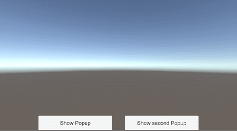

# Popups

Pile up popups and pop them out as you want.
The popup manager allows to show and hide popups, and handle going back and forth between opened popups.



## Usage

Follow these steps to have a complete system:

1. Add the **PopupHandler prefab into a Canvas** and change its RectTransform to choose where popups will all be located.
2. Add the popup prefab and **choose an Id**.
3. For each popup, create a **PopupDescriptor** using the Create / FredericRP / Popup Descriptor menu item and input the popup Id that you chose in the object pool.
4. To show a popup, call the below code with the correct descriptor.

> Popups have to be added in an **ObjectPool** for fast and efficient instantiating.

> Showing a popup hides any popup that was opened. Closing a popup re opens the previously shown popup so you can pile up popups without keeping a list nor path through them all.

```C#
[SerializeField]
PopupDescriptor popup = null;

// [...]
	
PopupHandler.ShowPopup(popup);
```

> You can close all popups including the hidden ones by calling:

```C#
PopupHandler.CloseAllPopups();
```

## Advanced

Every popup should have the PopupBase component at its root. It allows to get parameters specified when showing a popup. If you need specific parameters, you can inherit from this class.

When showing a new popup, the system also checks the parameters. If the popup **and** the parameters are identical, it does not do anything. Otherwise, it creates and show the new popup.

You can have a specific pool for your popups. The pool id is specified in the PopupHandler behaviour.

You also can add a time duration between popup hiding/showing to have a smooth effect between them. The default is set to 0.2 seconds.