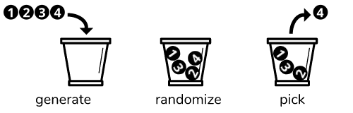

# Standard-Assets
Assets used in almost all of our projects. Some are quite old but still useful.

## Asset Bundle Tool

A simple local loader for asset bundles and an editor window that allows to export AssetBundles from unity.

## Bucket

A bucket (or bean bag) is a tool to get random numbers within an interval only once.

## Event Handler

A generic event handler that allows you to subscribe and trigger game events in your game in a minute. GameEvents have evolved thanks to the Unite 2017 presentation by Schell Games (but we still prefer our way to handle listener with delegates).

## Singleton

A generic singleton class that allows you to have Singleton in your project without reimplementing it every time and YES, I use Singleton !

## Object Pool & Inspector

Use ObjectPool to instantiate game objects during loading time and not during gameplay.
This version allows you to havec multiple pools in your game.

## Tips

A simple tool that allow to show random tips to user when a level is loading.
Tips are exported as AssetBundles.

## Transition

Between scenes, to hide loading time, you have to show a transition screen. Those two prefabs allow you to call the transition to be shown or hidden.
Subscribe to its events to know when you can load something behind the players back.
Requires the EventHandler and Singleton.

