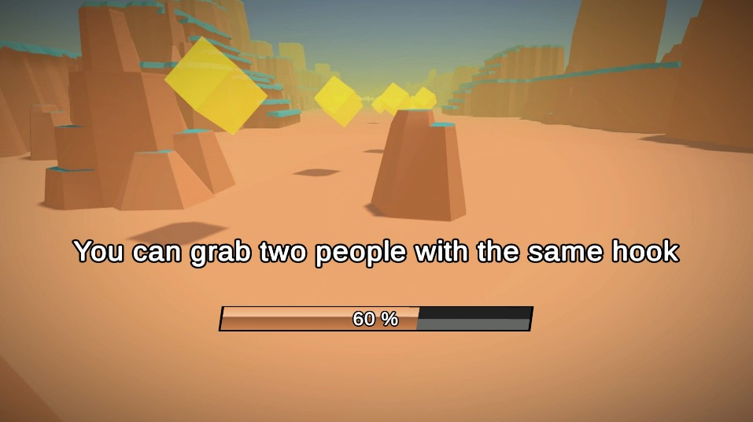

# Standard-Assets

Assets used in almost all of our projects.

# How to use

## Installation

1. Import the package
2. Some assets have a demo scene under their own "Sample" subfolder. Open those scenes to get a demo of how it works.
3. All assets have a README file, but you also have everything documented in this file.

## Asset Bundle Tool

A simple local loader for asset bundles and an editor window that allows to export AssetBundles from unity.

### Usage

1. Select assets in the project view and assign them to a new Asset bundle from the inspector (lower part).
2. Open the asset bundle editor window from the "Assets / FredericRP/ Asset Bundle Build" menu
3. Select the output directory
4. Click on Export button to create the asset bundles
5. Move them to the StreamingAssets root folder
6. Load them using the LocalLoader script

> *Remote bundles will be managed in a future release.*

## Bucket

A bucket (or bean bag) is a tool to get random numbers within an interval, only once.


This bucket generator provides an easy way for random round robin algorithm.

### Usage

Instantiate a new BucketGenerator and call *GetRandomNumber* method to obtain a number from the bucket.

### Demo
A demo scene is present under the Sample folder.


## Event Management

A generic event handler that allows you to subscribe and trigger game events in your game in a minute. GameEvents have evolved thanks to the Unite 2017 presentation by Schell Games (but we still prefer our way to handle listener with delegates).

### Usage

1. Create new game events from the project view using Create / FredericRP / [...] Game Event (with a typed parameter or no parameter)

2. Use it by Code
- add a delegate that will receive the event using AddEventListener (and RemoveEventListener)
- trigger the event using TriggerEvent

3. **OR** Use it with provided SimpleEventTrigger
- put this MonoBehaviour on a GameObject
- assign the game event you just created
- add as many unity events as you want to call functions

See the **Transition demo**.

## Generic Singleton

A singleton is a development pattern that prevents having multiple instances of the same component in a scene.
It allows also any script to access this one wihout requiring a manual link between the two.

This one is a generic Singleton that allows you to inherit from it from your class to access its instance with the static Instance property.

### Usage

Extends the Singleton<T> class from your own classes like this :

```C#
public class MyBrandNewClass : Singleton<MyBrandNewClass> {
// ...
}
```

You can call it from other scripts like this :

```C#
MyBrandNewClass.Instance.PublicMethod()
```

See Transition class for a demo.

## Object Pool & Inspector

Use ObjectPool to instantiate game objects during loading time and not during gameplay.
This version allows you to have multiple pools in your game, so you can have a global one that won't be destroyed between scenes, and some level-specific ones.


### Usage

1. Put the ObjectPool script in a game object that won't be destroyed during your game, and add the prefabs you want in the list in the inspector. Set the buffered amount, the default parent *(optional)*, and you're set.
2. To retrieve an already instantiated game object and use it in your game, use
```C#
ObjectPool.GetObjectPool("mypool").GetFromPool("myPrefabName")
```

3. To pool and deactivate a previously instantiated and retrieved game object, use
```C#
ObjectPool.GetObjectPool("mypool").Pool(usedObject)
```

> *To get it persistent between scenes attach a DontDestroyOnLoad script on the same Game Object.*

## Tips

A simple tool that allows to show random tips to user when a level is loading.

Tips are exported as AssetBundles.



## Transition

Between scenes, to hide loading time or simply make a smooth transition, you have to show a transition screen. Those two prefabs allow you to call the transition to be shown or hidden.

Subscribe to its events (TransitionShown and TransitionHidden) to know when you can load something behind the players back.

> *Requires the EventHandler and Singleton.*


### Demo

A demo is present under the Sample folder.

1. Load the scene
2. Click the Play button
3. In the editor, use the [S] key to show the transition, and the [H] key to hide it.


# That's all folks !

Thanks for downloading this unity package, I hope this one will be added to your favorites one. Those assets saved us a lot of time when we developed games for clients and gamers, and hopefully it will do the same to you.

Here are some useful links to reach me:

Other assets: https://store.fredericrp.com

Twitter: https://twitter.com/fredericrp

Website: https://fredericrp.com