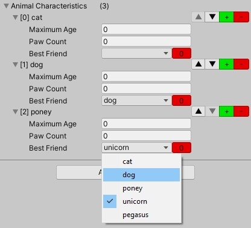
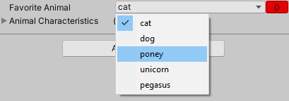

# String data list

Let say you want to allow your designer to edit some string properties in your project (you, fool) but there are only a limited amount of allowed strings, like characters names, seasons or anything, and for whatever reason, you don't want or cannot use enums.
Or maybe you have a list of data, and you don't want to have a "name" property of each data nor you want the list to display "Element 0", "Element 1", but instead you want to use your own names: for instance "Cat, dog, unicorn, etc".

This is the asset for you.



## Description

There are two attributes and drawer:
- [Select("characters")]: allow to enter a string by selecting a name in the list
- [DataList("season")]: allow to customise the element names of a list

The parameter in parenthesis is used to load a TXT file of that name from the **datalist** folder in the **Resources** of your project.

In those examples, there would be a characters.txt file and a season.txt file.

## Usage

### String Select

1. Create a TXT file in a Resources/datalist folder in your project, named after the data your want to enter
2. Add one line per data
3. Add the [Select] attribute on a string property to be able to enter a string only from that file content as below

 ```C#
 [SerializeField]
 [Select("animal")]
 string favoriteAnimal;
  ```



### List element customisation

1. Create a TXT file in a Resources/datalist folder in your project, named after the names kind your want
2. Add one line per data
3. Create a child class from the generic DataList<T> provided class
3. Add the [DataList] attribute to a list or array property on another MonoBehaviour or ScriptableObject class

## Demo

A demo is present under the Sample folder.

1. Load the scene
2. Select the only game object
3. In the inspector, select your favorite animal from the list, and add and/or remove characteristics.
