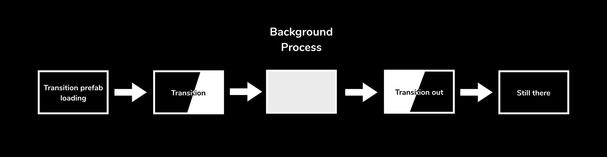

# Transition

Between scenes, to hide loading time or simply make a smooth transition, you have to show a transition screen. Those two prefabs allow you to call the transition to be shown or hidden.

Subscribe to its events (TransitionShown and TransitionHidden) to know when you can load something behind the players back.

> *Requires the EventHandler and Singleton.*

## Description

There are two types of transition:
- Doors : use two images that hide the screen by scrolling from the left and right borders of the screen
- CutOff : use a gradient image to show/hide a texture fullscreen

## Usage

1. Place chosen prefab in scene
2. Call Transition.Show()
3. Do whatever you want behind the player's back
4. Call Transition.Hide()

Optionnal : subscribe to the game events to trigger at the right time what you want to do.

### Demo

A demo is present under the Sample folder.

1. Load the scene
2. Click the Play button
3. In the editor, use the [S] key to show the transition, and the [H] key to hide it.

